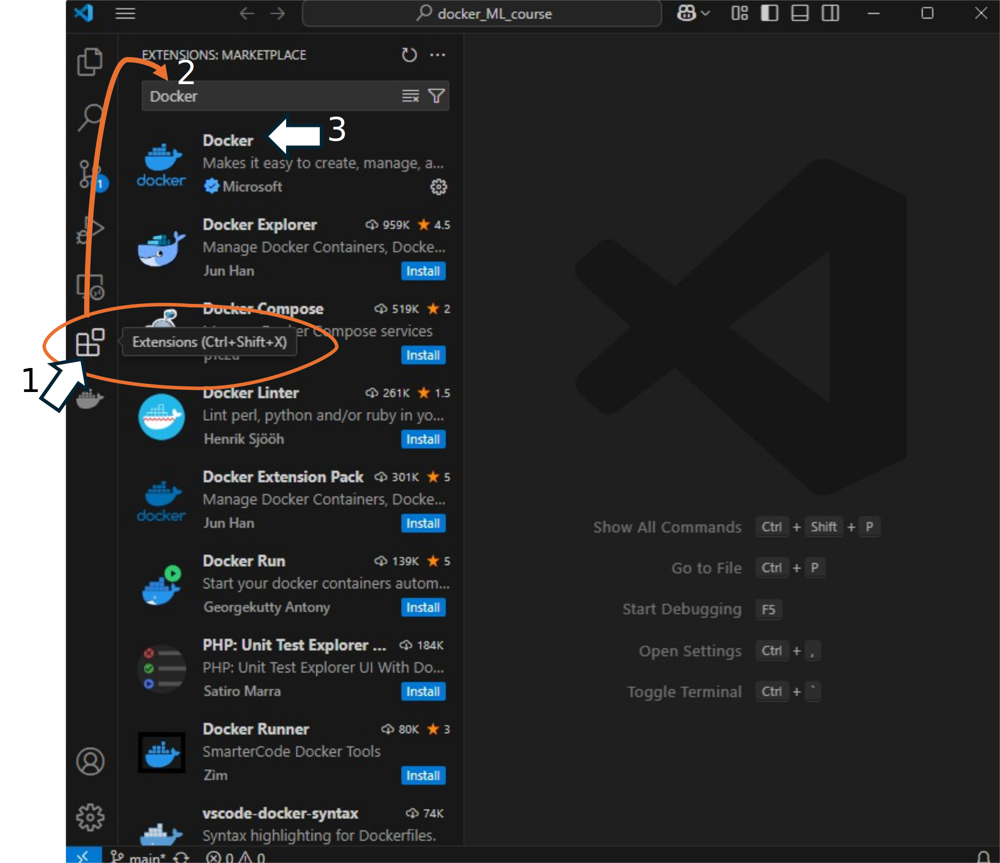

# Get ready your computer ready for the course

If you are joining us for this course or plan to try this material on your own, here is our plan to get you started and running the exercises.

Keep in mind that if you followed the course **"Introduction to Git & GitHub"** and the course **"Introduction to HPC: structure and practice "** some of this you must have alredy done.


### 1. WSL for WINDOWS system users

You need to have WSL the ***Windows subsystem for Linux*** 

**a.** You will need windows 10 (version 2004 and higher) or windows 11!

**b.** Open the CMD terminal and install WSL `wsl --install`. Once you have it, the next step is to install Ubuntu.

**c.** To have a list of the linux distributions available type `wsl --list --online` in the CMD terminal. Get the most up-to-date but not beta version.

**d.** To install or update your version use `wsl --install -d <dist_name>`, we suggest **Ubuntu-20-04** 

**e.** It is advised that you restart your computer after this


### 2 . Install **Docker** or **Docker desktop** to run it locally.

For [Windows](https://docs.docker.com/desktop/install/windows-install/)

>
> You will need to enable WSL if you are using windows. 
>

For [MAC](https://docs.docker.com/desktop/install/mac-install/)
  
For Linux you can install it in [the terminal](https://docs.docker.com/engine/install/ubuntu/) directly and skip Docker Desktop, or install the [Desktop](https://docs.docker.com/desktop/install/linux-install/)


### 3. Get any text editor to work

This step is specially relevant if you are Windows user. On Linux and MAC computers you are encoraged to use the local terminal and your favorite code editor. Hoever, you could still benefit from havin one of these installed and you can access them from your terminal or use as regular editor. These editor have integrated terminal what is specially important for Windows users.

Suggested editor: [VScode](https://code.visualstudio.com/download)

**a.** If you decide to use VSCode terminal instead of your native terminal, you will need to install the Docker extension to have docker running. 

<center></center>

**b.** You need to integrate WSL with VSCode 
  
  - press F1 and search/choose **WSL: Connect to WSL**

  - press F1 and search/choose **Terminal: Select Default Profile**

  - choose the **Ubuntu-Version (WSL)** option

P.S.: If you use Poweshell you will have issues with path recognition and if you use Bash you will have only the minimum required system, it is still better then powershell.


### 3. You need Git 

You will need this to be able to locally access the repository with the necessary mean to the exercises that will be developed in the course.

Install Git
------

**a.** Install git 

For Windows you need to download and install [GitBash](https://git-scm.com/downloads/win), to use git in your computer.

For Linux and MAC users, test `git -v`, you probably alredy have it. If you need to install you can try `sudo apt-get install git` 

**b.** Create your config file

```
git config --global user.name "Your Name"
git config --global user.email "youremail@domain.com"
```

Clone the repository
------

**a.** Access your terminal and in a course dedicated folder use the command bellow to clone the repository

```
git clone https://github.com/vibbits/containers-workshop.git
```

### 4. Set your VSC account

Check how to do it [here](https://liascript.github.io/course/?https://raw.githubusercontent.com/vibbits/intro_2_HPC/main/Chapters/GetReady4training.md#2)
